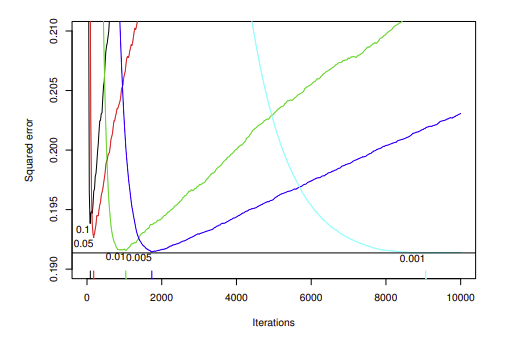
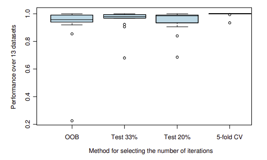

# Loading in Data
```{r}
load(file="StudentGrades.RData")
head(studentgrades)
```

# Gradient Boosted Model

## Summary of the Boosting Process

1. **Initialize the model** with a constant value, typically the mean of the target values for regression:

\[ 
F_0(x) = \arg\min_{c} \sum_{i=1}^{N} L(y_i, c)
\]

2. **For \(m = 1\) to \(M\) (number of boosting iterations)**:
   - Compute the residuals \(r_i^m\)
   - For squared error loss, this simplifies to:
\[
r_i^m = y_i - F_{m-1}(x_i)
\]
   - Fit a base learner \(h_m(x)\) to the residuals.
   - Update the model via gradient decent:

\[
F_{m}(x) = F_{m-1}(x) + \nu h_m(x)
\]

3. **Final prediction** is the sum of all base learners:

\[
\hat{y} = F_M(x) = \sum_{m=1}^{M} \nu h_m(x)
\]


- What we are controlling and changing:
    - Boosting iterations (\texttt{ntrees}): variable...
    - Learning rate (\texttt{shrinkage} parameter): 0.05
    - Loss function distribution: Gaussian


## Shrinkage and Iterations



Figure 3: Out-of-sample predictive performance by number of iterations and shrinkage. Smaller values of the shrinkage parameter offer improved predictive performance, but with decreasing marginal improvement. (from vignette)



Figure 4: Out-of-sample predictive performance of four methods of selecting the optimal number of iterations. The vertical axis plots performance relative the best. The boxplots indicate relative performance across thirteen real datasets from the UCI repository. (from vignette)

The vignette recommends to use 5 or 10-fold CV if you can afford the computation time. Otherwise OOB is a good conservative choice.

## GBM Data Prep

```{r GBM data prep}
# Identifying the course of interest
COI <- "MATH.200"
coursegrades <- studentgrades[!is.na(studentgrades[,COI]),-c(1,3,5)]

# remove all grades < 50%
coursegrades <- coursegrades[coursegrades$MATH.200 >= 50, ]

# factoring student majors
coursegrades$Major.1 <- factor(coursegrades$Major.1)
# factoring student minors
coursegrades$Minor <- factor(coursegrades$Minor)


# dropping columns that are very sparse (pct % are NA)
pct <- 0.85
courses <- numeric(0)
for (i in 1:ncol(coursegrades)) {
  if(is.na(coursegrades[,i]) |> sum()  > nrow(coursegrades)*pct){
    courses <- c(courses,i)
  }
}

coursegrades <- coursegrades[,-courses]


# removing all students who don't meet course pre reqs DATA 101, COSC 221
# coursegrades <- coursegrades[!is.na(coursegrades$MATH.101) & !is.na(coursegrades$MATH.221), ]

coursegrades <- coursegrades[!is.na(coursegrades$MATH.101), ]


# Removing all course columns of higher years
YOI <- as.integer(substr(strsplit(COI, split = ".", fixed = TRUE)[[1]][2],1,1))

column_names <- colnames(coursegrades)

# Extract digits after the period in column names
column_digits <- as.integer(sub("^[^.]+\\.([0-9]).*", "\\1", column_names))

# Find columns with digits not matching the selected course year
cols_to_keep <- column_names[column_digits <= YOI]

# All columns in the same year or below
coursegrades <- coursegrades[, colnames(coursegrades) %in% cols_to_keep]
```

## Iteration Graphs

```{r GBM Num Tree Graphs}
library(gbm)

gbm_params <- list(
  distribution = "gaussian",  # Specify the distribution for regression
  n.trees = 10000,               # Number of trees (iterations)
  interaction.depth = 3,       # Maximum depth of trees
  shrinkage = 0.001,            # Learning rate (shrinkage)
  bag.fraction = 0.5,          # Fraction of training data used for each tree
  train.fraction = 1.0,        # Fraction of training data used for training (1.0 for full dataset)
  n.minobsinnode = 5          # Minimum number of observations in terminal nodes
)

# Running model first time on base params
gbm_model <- gbm(MATH.200 ~ ., data = coursegrades, distribution = gbm_params$distribution,
                 n.trees = gbm_params$n.trees, interaction.depth = gbm_params$interaction.depth,
                 shrinkage = gbm_params$shrinkage, bag.fraction = gbm_params$bag.fraction,
                 train.fraction = gbm_params$train.fraction, n.minobsinnode = gbm_params$n.minobsinnode, cv.folds = 5)


print(gbm.perf(gbm_model, method="cv"))
print(gbm.perf(gbm_model, method="OOB"))
```

## Model Training and Prediction

```{r GBM}
set.seed(5934)
n_rows <- nrow(coursegrades)
train_indices <- sample(1:n_rows, 0.8 * n_rows)  # 80% of rows for training
test_indices <- setdiff(1:n_rows, train_indices) # remaining rows for testing

library(gbm)

gbm_params <- list(
  distribution = "gaussian",  # Specify the distribution for regression
  n.trees = 7000,               # Number of trees (iterations)
  interaction.depth = 3,       # Maximum depth of trees
  shrinkage = 0.001,            # Learning rate (shrinkage)
  bag.fraction = 0.5,          # Fraction of training data used for each tree
  train.fraction = 1.0,        # Fraction of training data used for training (1.0 for full dataset)
  n.minobsinnode = 5          # Minimum number of observations in terminal nodes
)

# Running model first time on base params
gbm_model <- gbm(MATH.200 ~ ., data = coursegrades, distribution = gbm_params$distribution,
                 n.trees = gbm_params$n.trees, interaction.depth = gbm_params$interaction.depth,
                 shrinkage = gbm_params$shrinkage, bag.fraction = gbm_params$bag.fraction,
                 train.fraction = gbm_params$train.fraction, n.minobsinnode = gbm_params$n.minobsinnode, cv.folds = 5)

# saving optimal # of trees
ntrees <- gbm.perf(gbm_model,method="cv")[1]


# Running model a second time with optimal # of trees
gbm_model <- gbm(MATH.200 ~ ., data = coursegrades[train_indices,], distribution = gbm_params$distribution,
                 n.trees = ntrees, interaction.depth = gbm_params$interaction.depth,
                 shrinkage = gbm_params$shrinkage, bag.fraction = gbm_params$bag.fraction,
                 train.fraction = gbm_params$train.fraction, n.minobsinnode = gbm_params$n.minobsinnode, cv.folds = 5)

# Print the summary of the trained model
print(summary(gbm_model))

# Make predictions on new data
predictions <- predict(gbm_model, newdata = coursegrades[test_indices,], n.trees = ntrees)

rmse <- sqrt(mean((predictions - coursegrades[test_indices,COI])^2))
rmse
```


```{r}
actual <- coursegrades[test_indices,]$MATH.200
plot(actual, predictions, xlab = "Actual Grades", ylab = "Predicted Grades", 
     main = "Predicted vs Actual Grades", pch = 16, col = "blue", xlim = c(0,100), ylim = c(0,100))
abline(0, 1, col = "red")


line.lm <- lm(predictions~actual)
abline(line.lm, col = "green")
```


```{r adding error bars}
## calculating size of error bars
errors <- abs(predictions - actual)
error_bars <- sd(errors)


## plotting graph and error bars
plot(actual, predictions, 
     xlab = "Actual Grades", ylab = "Predicted Grades",
     main = "Predicted vs Actual Grades with Error Bars", xlim = c(0,100), ylim = c(0,100),pch = 16)

# Add error bars
arrows(actual, predictions - error_bars, 
       actual, predictions + error_bars, 
       angle = 90, code = 3, length = 0.1, col = 1:length(predictions))

abline(0, 1, col = "red")
```

```{r training quantile ranges}
## training two more gbms using quantile ranges as the prediction interval

gbm_params <- list(
  distribution = list(name = "quantile", alpha = 0.025),  # Specify the distribution for regression
  n.trees = 8000,               # Number of trees (iterations)
  interaction.depth = 4,       # Maximum depth of trees
  shrinkage = 0.001,            # Learning rate (shrinkage)
  bag.fraction = 0.5,          # Fraction of training data used for each tree
  train.fraction = 1.0,        # Fraction of training data used for training (1.0 for full dataset)
  n.minobsinnode = 5          # Minimum number of observations in terminal nodes
)

# Running model first time on base params
gbm_model <- gbm(STAT.230 ~ ., data = coursegrades[train_indices,], distribution = gbm_params$distribution,
                 n.trees = gbm_params$n.trees, interaction.depth = gbm_params$interaction.depth,
                 shrinkage = gbm_params$shrinkage, bag.fraction = gbm_params$bag.fraction,
                 train.fraction = gbm_params$train.fraction, n.minobsinnode = gbm_params$n.minobsinnode, cv.folds = 5)

LB_predictions <- predict(gbm_model, newdata = coursegrades[test_indices,], n.trees = ntrees)


gbm_params <- list(
  distribution = list(name = "quantile", alpha = 0.975),  # Specify the distribution for regression
  n.trees = 8000,               # Number of trees (iterations)
  interaction.depth = 4,       # Maximum depth of trees
  shrinkage = 0.001,            # Learning rate (shrinkage)
  bag.fraction = 0.5,          # Fraction of training data used for each tree
  train.fraction = 1.0,        # Fraction of training data used for training (1.0 for full dataset)
  n.minobsinnode = 5          # Minimum number of observations in terminal nodes
)

# Running model first time on base params
gbm_model <- gbm(STAT.230 ~ ., data = coursegrades[train_indices,], distribution = gbm_params$distribution,
                 n.trees = gbm_params$n.trees, interaction.depth = gbm_params$interaction.depth,
                 shrinkage = gbm_params$shrinkage, bag.fraction = gbm_params$bag.fraction,
                 train.fraction = gbm_params$train.fraction, n.minobsinnode = gbm_params$n.minobsinnode, cv.folds = 5)

UB_predictions <- predict(gbm_model, newdata = coursegrades[test_indices,], n.trees = ntrees)
```


```{r quantile gbm error bars}
## plotting graph and error bars
plot(actual, predictions, 
     xlab = "Actual Grades", ylab = "Predicted Grades",
     main = "Predicted vs Actual Grades with Error Bars", xlim = c(00,100), ylim = c(0,100),pch = 16)

# Add error bars
arrows(actual, LB_predictions, 
       actual, UB_predictions, 
       angle = 90, code = 3, length = 0.1, col = 1:length(predictions))

abline(0, 1, col = "red")
```


```{r bootstrap gbm error bars}
# bootstrapping the model x times
n_iterations = 50  # Number of bootstrapped models
boot_preds = numeric(0)


library(gbm)

gbm_params <- list(
  distribution = "gaussian",  # Specify the distribution for regression
  n.trees = 6000,               # Number of trees (iterations)
  interaction.depth = 3,       # Maximum depth of trees
  shrinkage = 0.001,            # Learning rate (shrinkage)
  bag.fraction = 0.5,          # Fraction of training data used for each tree
  train.fraction = 1.0,        # Fraction of training data used for training (1.0 for full dataset)
  n.minobsinnode = 5          # Minimum number of observations in terminal nodes
)


for(i in 1:n_iterations){
  # Create a bootstrapped dataset
  set.seed(100+i)
  
  n_rows <- nrow(coursegrades)
  train_indices <- sample(1:n_rows, 0.8 * n_rows)  # 80% of rows for training
  test_indices <- setdiff(1:n_rows, train_indices) # remaining rows for testing
    
  gbm_model <- gbm(STAT.230 ~ ., data = coursegrades[train_indices,], distribution = gbm_params$distribution,
                 n.trees = gbm_params$n.trees, interaction.depth = gbm_params$interaction.depth,
                 shrinkage = gbm_params$shrinkage, bag.fraction = gbm_params$bag.fraction,
                 train.fraction = gbm_params$train.fraction, n.minobsinnode = gbm_params$n.minobsinnode, cv.folds = 5)

  
  # Predict on test data
  preds <- predict(gbm_model, newdata = coursegrades[test_indices,], n.trees = ntrees)
  boot_preds <- append(boot_preds, preds)
  
}

# Convert predictions to a NumPy array
#predictions

# Calculate the mean and standard deviation of the predictions
mean_preds = mean(boot_preds)
std_preds = sd(boot_preds)

# Confidence intervals
lower_bound = mean_preds - 1.96 * std_preds
upper_bound = mean_preds + 1.96 * std_preds

```

```{r adding error bars}
## plotting graph and error bars made from bootstrapping predictions from many different models
UB_predictions <- predictions + 1.96 * std_preds
LB_predictions <- predictions - 1.96 * std_preds


plot(actual, predictions, 
     xlab = "Actual Grades", ylab = "Predicted Grades",
     main = "Predicted vs Actual Grades with Error Bars", xlim = c(00,100), ylim = c(0,100),pch = 16)

# Add error bars
arrows(actual, LB_predictions, 
       actual, UB_predictions, 
       angle = 90, code = 3, length = 0.1, col = 1:length(predictions))

abline(0, 1, col = "red")
```


```{r}
# length(predictions)
# sum(actual < LB_predictions)
# 
# 
# coursegrades[test_indices[lowpred],]
# predictions[lowpred]


# actual grade below lower bound
lowpred <- which(actual < LB_predictions)
# actual grade above upper bound
# lowpred <- which(actual > UB_predictions)
# lower bound below 50
# lowpred <- which(LB_predictions <= 50)
# lower bound within 5 of actual grade
# lowpred <- which(abs(actual - LB_predictions) <= 5 | actual < LB_predictions)

## plotting graph and error bars
plot(actual[lowpred], predictions[lowpred], 
     xlab = "Actual Grades", ylab = "Predicted Grades",
     main = "Predicted vs Actual Grades with Error Bars", xlim = c(00,100), ylim = c(0,100),pch = 16)

# Add error bars
arrows(actual[lowpred], LB_predictions[lowpred], 
       actual[lowpred], UB_predictions[lowpred], 
       angle = 90, code = 3, length = 0.1, col = 1:length(predictions[lowpred]))

abline(0, 1, col = "red")
```


```{r gridSearch on GBM}
library(caret)
library(tidyverse)

train_control = trainControl(method = "cv", number = 5, search = "grid")

gbmGrid <-  expand.grid(
  # distribution = "gaussian",  # Specify the distribution for regression
  n.trees = c(200,500,1000,1500,2000),               # Number of trees (iterations)
  interaction.depth = c(3:7),       # Maximum depth of trees
  shrinkage = c(0.025,0.01,0.005,0.0025,0.001),           # Learning rate (shrinkage)
  # bag.fraction = 0.5,          # Fraction of training data used for each tree
  # train.fraction = 1.0,        # Fraction of training data used for training (1.0 for full dataset)
  n.minobsinnode = c(5,8,10,12,15)          # Minimum number of observations in terminal nodes
)

# training a Gboost Regression tree model while tuning parameters
model = train(STAT.230~., data = coursegrades[train_indices], method = "gbm", trControl = train_control, tuneGrid = gbmGrid, na.action = na.pass)

# summarising the results
print(model)

# Make predictions on new data
# predictions <- predict(model$bestTune, newdata = coursegrades[test_indices,], n.trees = ntrees)
# 
# rmse <- sqrt(mean((predictions - coursegrades[test_indices,COI])^2))
# rmse
```


```{r extreme gradient boosting}
library(xgboost)

set.seed(5934)
# set.seed(555)
n_rows <- nrow(coursegrades)
train_indices <- sample(1:n_rows, 0.8 * n_rows)  # 80% of rows for training
test_indices <- setdiff(1:n_rows, train_indices) # remaining rows for testing

## xgbm data setup
train_data <- xgb.DMatrix(as.matrix(coursegrades[train_indices,!names(coursegrades) %in% c("STAT.230")]), label = coursegrades[train_indices,"STAT.230"])
test_data <- xgb.DMatrix(as.matrix(coursegrades[test_indices,!names(coursegrades) %in% c("STAT.230")]), label = coursegrades[test_indices,"STAT.230"])


watchlist = list(train=train_data, test=test_data)

xgbm_model <- xgb.train(data=train_data, max.depth=4, eta=0.01, nthread = 2, nrounds=1000, lambda = 0, booster = "gbtree", subsample = 0.5, tree_method = "auto", watchlist=watchlist, objective = "reg:squarederror", verbose = 0, early_stopping_rounds = 10, colsample_bytree = 0.5)

# Print the summary of the trained model
summary(xgbm_model)


# Make predictions on new data
predictions <- predict(xgbm_model, test_data)

rmse <- sqrt(mean((predictions - coursegrades[test_indices,COI])^2))
rmse
```

```{r}
actual <- coursegrades[test_indices,]$STAT.230
plot(actual, predictions, xlab = "Actual Grades", ylab = "Predicted Grades", 
     main = "Predicted vs Actual Grades", pch = 16, col = "blue", xlim = c(0,100), ylim = c(0,100))
abline(0, 1, col = "red")


line.lm <- lm(predictions~actual)
abline(line.lm, col = "green")
```

```{r xGBM quantile error bars}
# bootstrapping the model x times 

n_iterations = 100  # Number of bootstrapped models
predictions = numeric(0)

for(i in 1:n_iterations){
  # Create a bootstrapped dataset
  set.seed(100+i)
  
  n_rows <- nrow(coursegrades)
  train_indices <- sample(1:n_rows, 0.8 * n_rows)  # 80% of rows for training
  test_indices <- setdiff(1:n_rows, train_indices) # remaining rows for testing
    
  # Train an XGBoost model
  train_data <- xgb.DMatrix(as.matrix(coursegrades[train_indices,!names(coursegrades) %in% c("STAT.230")]), label = coursegrades[train_indices,"STAT.230"])
  test_data <- xgb.DMatrix(as.matrix(coursegrades[test_indices,!names(coursegrades) %in% c("STAT.230")]), label = coursegrades[test_indices,"STAT.230"])

  watchlist = list(train=train_data, test=test_data)

  xgbm_model <- xgb.train(data=train_data, max.depth=4, eta=0.01, nthread = 2, nrounds=1000, lambda = 0, booster = "gbtree", subsample = 0.5, tree_method = "auto", watchlist=watchlist, objective = "reg:squarederror", verbose = 0, early_stopping_rounds = 10, colsample_bytree = 0.5)
    
  # Predict on test data
  preds <- predict(xgbm_model, test_data)
  predictions <- append(predictions, preds)
  
  sprintf("%s done", i)
}

# Convert predictions to a NumPy array
#predictions

# Calculate the mean and standard deviation of the predictions
mean_preds = mean(predictions)
std_preds = sd(predictions)

# Confidence intervals
lower_bound = mean_preds - 1.96 * std_preds
upper_bound = mean_preds + 1.96 * std_preds

```

```{r adding error bars}
## plotting graph and error bars made from bootstrapping predictions from many different models
UB_predictions <- predictions + 1.96 * std_preds
LB_predictions <- predictions - 1.96 * std_preds


plot(actual, predictions, 
     xlab = "Actual Grades", ylab = "Predicted Grades",
     main = "Predicted vs Actual Grades with Error Bars", xlim = c(00,100), ylim = c(0,100),pch = 16)

# Add error bars
arrows(actual, LB_predictions, 
       actual, UB_predictions, 
       angle = 90, code = 3, length = 0.1, col = 1:length(predictions))

abline(0, 1, col = "red")
```

```{r gridSearch on xGBM}
library(caret)
library(tidyverse)

searchGridSubCol <- expand.grid(subsample = c(0.5, 0.65, 0.8), 
                                colsample_bytree = c(0.5, 0.75, 1),
                                max_depth = c(1, 2),
                                lambda = c(0,1,2), 
                                alpha = c(0,1,2),
                                min_child = c(1,3),
                                eta = c(0.05, 0.01, 0.005, 0.001)
)

ntrees <- 10000

system.time(
rmseErrorsHyperparameters <- apply(searchGridSubCol, 1, function(parameterList){
  
  #Extract Parameters to test
  currentSubsampleRate <- parameterList[["subsample"]]
  currentColsampleRate <- parameterList[["colsample_bytree"]]
  currentDepth <- parameterList[["max_depth"]]
  currentEta <- parameterList[["eta"]]
  currentLambda <- parameterList[["lambda"]]
  currentAlpha <- parameterList[["alpha"]]
  currentMinChild <- parameterList[["min_child"]]
  xgboostModelCV <- xgb.cv(data =  train_data, nrounds = ntrees, nfold = 5, showsd = TRUE, 
                       metrics = "rmse", verbose = TRUE, "eval_metric" = "rmse",
                     "objective" = "reg:linear", "max.depth" = currentDepth, "eta" = currentEta,                               
                     "subsample" = currentSubsampleRate, "colsample_bytree" = currentColsampleRate
                      , print_every_n = 10, "lambda" = currentLambda, "alpha" = currentAlpha, "min_child" = currentMinChild, booster = "gbtree",
                     early_stopping_rounds = 10)
  
  xvalidationScores <- as.data.frame(xgboostModelCV$evaluation_log)
  rmse <- tail(xvalidationScores$test_rmse_mean, 1)
  trmse <- tail(xvalidationScores$train_rmse_mean,1)
  output <- return(c(rmse, trmse, currentSubsampleRate, currentColsampleRate, currentDepth, currentEta, currentMinChild))}))
```


```{r}
# save(file="xgb_grid_search.RData", xgb_hyperparams)
# load("xgb_grid_search.RData")

xgb_hyperparams <- data.frame(t(rmseErrorsHyperparameters))
xgb_hyperparams$lambda <- searchGridSubCol$lambda
xgb_hyperparams$alpha <- searchGridSubCol$alpha

colnames(xgb_hyperparams) <- c("rmse", "trmse", "subsample", "colsample_bytree", "max_depth", "eta", "min_child", "lambda", "alpha")

xgb_hyperparams[order(xgb_hyperparams$rmse),]
```

```{r}
searchGridSubCol
```


## Test on professor data

```{r}
load(file="Prof_StudentGrades.RData")
head(studentgrades_prof)
```


```{r GBM prof data prep}
# Identifying the course of interest
COI <- "STAT.230"
coursegrades <- studentgrades_prof[!is.na(studentgrades_prof[,COI]),-c(1,3,5)]

# remove all grades < 50%
coursegrades <- coursegrades[coursegrades$STAT.230 >= 5, ]

# factoring student majors
coursegrades$Major.1 <- factor(coursegrades$Major.1)
# factoring student minors
coursegrades$Minor <- factor(coursegrades$Minor)


# dropping columns that are very sparse (pct % are NA)
pct <- 0.9
courses <- numeric(0)
for(i in 1:ncol(coursegrades)) {
  if(is.na(coursegrades[,i]) |> sum()  > nrow(coursegrades)*pct){
    courses <- c(courses,i)
  }
}
# subsetting out sparse columns
coursegrades <- coursegrades[,-courses]


# Removing all course columns of higher years
YOI <- as.integer(substr(strsplit(COI, split = ".", fixed = TRUE)[[1]][2],1,1))

column_names <- colnames(coursegrades)

# Extract digits after the period in column names
column_digits <- as.integer(sub("^[^.]+\\.([0-9]).*", "\\1", column_names))

# Find columns with digits not matching the selected course year
cols_to_keep <- column_names[column_digits <= YOI]

# All columns in the same year or below
coursegrades <- coursegrades[, colnames(coursegrades) %in% cols_to_keep]


# removing all students (rows) who don't meet course pre reqs DATA 101, COSC 221
coursegrades <- coursegrades[!is.na(coursegrades$DATA.101) | !is.na(coursegrades$COSC.221), ]


```


```{r GBM on prof data}
set.seed(5934)
n_rows <- nrow(coursegrades)
train_indices <- sample(1:n_rows, 0.8 * n_rows)  # 80% of rows for training
test_indices <- setdiff(1:n_rows, train_indices) # remaining rows for testing

library(gbm)

gbm_params <- list(
  distribution = "gaussian",  # Specify the distribution for regression
  n.trees = 8000,               # Number of trees (iterations)
  interaction.depth = 3,       # Maximum depth of trees
  shrinkage = 0.001,            # Learning rate (shrinkage)
  bag.fraction = 0.5,          # Fraction of training data used for each tree
  train.fraction = 1.0,        # Fraction of training data used for training (1.0 for full dataset)
  n.minobsinnode = 5          # Minimum number of observations in terminal nodes
)

# Running model first time on base params
gbm_model <- gbm(STAT.230 ~ ., data = coursegrades, distribution = gbm_params$distribution,
                 n.trees = gbm_params$n.trees, interaction.depth = gbm_params$interaction.depth,
                 shrinkage = gbm_params$shrinkage, bag.fraction = gbm_params$bag.fraction,
                 train.fraction = gbm_params$train.fraction, n.minobsinnode = gbm_params$n.minobsinnode, cv.folds = 5)

# saving optimal # of trees
ntrees <- gbm.perf(gbm_model,method="cv")[1]


# Running model a second time with optimal # of trees
gbm_model <- gbm(STAT.230 ~ ., data = coursegrades[train_indices,], distribution = gbm_params$distribution,
                 n.trees = ntrees, interaction.depth = gbm_params$interaction.depth,
                 shrinkage = gbm_params$shrinkage, bag.fraction = gbm_params$bag.fraction,
                 train.fraction = gbm_params$train.fraction, n.minobsinnode = gbm_params$n.minobsinnode, cv.folds = 5)

# Print the summary of the trained model
print(summary(gbm_model))

# Make predictions on new data
predictions <- predict(gbm_model, newdata = coursegrades[test_indices,], n.trees = ntrees)

rmse <- sqrt(mean((predictions - coursegrades[test_indices,COI])^2))
rmse
```


```{r prof prediction graph}
actual <- coursegrades[test_indices,]$STAT.230
plot(actual, predictions, xlab = "Actual Grades", ylab = "Predicted Grades", 
     main = "Predicted vs Actual Grades", pch = 16, col = "blue", xlim = c(0,100), ylim = c(0,100))
abline(0, 1, col = "red")


line.lm <- lm(predictions~actual)
abline(line.lm, col = "green")
```

```{r}
coursegrades[,c("STAT.230","STAT.230.P","ENGL.112","ENGL.112.P")]
unique(coursegrades$ENGL.112)
```


```{r bootstrap gbm error bars (prof)}
# bootstrapping the model x times
n_iterations = 50  # Number of bootstrapped models
boot_preds = numeric(0)


library(gbm)

gbm_params <- list(
  distribution = "gaussian",  # Specify the distribution for regression
  n.trees = 8000,               # Number of trees (iterations)
  interaction.depth = 3,       # Maximum depth of trees
  shrinkage = 0.001,            # Learning rate (shrinkage)
  bag.fraction = 0.5,          # Fraction of training data used for each tree
  train.fraction = 1.0,        # Fraction of training data used for training (1.0 for full dataset)
  n.minobsinnode = 5          # Minimum number of observations in terminal nodes
)


for(i in 1:n_iterations){
  # Create a bootstrapped dataset
  set.seed(100+i)
  
  n_rows <- nrow(coursegrades)
  train_indices <- sample(1:n_rows, 0.8 * n_rows)  # 80% of rows for training
  test_indices <- setdiff(1:n_rows, train_indices) # remaining rows for testing
    
  gbm_model <- gbm(STAT.230 ~ ., data = coursegrades[train_indices,], distribution = gbm_params$distribution,
                 n.trees = gbm_params$n.trees, interaction.depth = gbm_params$interaction.depth,
                 shrinkage = gbm_params$shrinkage, bag.fraction = gbm_params$bag.fraction,
                 train.fraction = gbm_params$train.fraction, n.minobsinnode = gbm_params$n.minobsinnode, cv.folds = 5)

  
  # Predict on test data
  preds <- predict(gbm_model, newdata = coursegrades[test_indices,], n.trees = ntrees)
  boot_preds <- append(boot_preds, preds)
  
}

# Convert predictions to a NumPy array
#predictions

# Calculate the mean and standard deviation of the predictions
mean_preds = mean(boot_preds)
std_preds = sd(boot_preds)

# Confidence intervals
lower_bound = mean_preds - 1.96 * std_preds
upper_bound = mean_preds + 1.96 * std_preds

```

```{r adding error bars}
## plotting graph and error bars made from bootstrapping predictions from many different models
UB_predictions <- predictions + 1.96 * std_preds
LB_predictions <- predictions - 1.96 * std_preds


plot(actual, predictions, 
     xlab = "Actual Grades", ylab = "Predicted Grades",
     main = "Predicted vs Actual Grades with Error Bars", xlim = c(00,100), ylim = c(0,100),pch = 16)

# Add error bars
arrows(actual, LB_predictions, 
       actual, UB_predictions, 
       angle = 90, code = 3, length = 0.1, col = 1:length(predictions))

abline(0, 1, col = "red")
```

```{r GBM recursive variable selection on prof data}

set.seed(5934)
n_rows <- nrow(coursegrades)
train_indices <- sample(1:n_rows, 0.8 * n_rows)  # 80% of rows for training
test_indices <- setdiff(1:n_rows, train_indices) # remaining rows for testing

library(gbm)

gbm_params <- list(
  distribution = "gaussian",  # Specify the distribution for regression
  n.trees = 8000,               # Number of trees (iterations)
  interaction.depth = 3,       # Maximum depth of trees
  shrinkage = 0.001,            # Learning rate (shrinkage)
  bag.fraction = 0.5,          # Fraction of training data used for each tree
  train.fraction = 1.0,        # Fraction of training data used for training (1.0 for full dataset)
  n.minobsinnode = 5          # Minimum number of observations in terminal nodes
)

# Running model first time on base params
gbm_model <- gbm(STAT.230 ~ ., data = coursegrades, distribution = gbm_params$distribution,
                 n.trees = gbm_params$n.trees, interaction.depth = gbm_params$interaction.depth,
                 shrinkage = gbm_params$shrinkage, bag.fraction = gbm_params$bag.fraction,
                 train.fraction = gbm_params$train.fraction, n.minobsinnode = gbm_params$n.minobsinnode, cv.folds = 5)

# saving optimal # of trees
ntrees <- gbm.perf(gbm_model,method="cv")[1]


# Running model a second time with optimal # of trees
gbm_model <- gbm(STAT.230 ~ ., data = coursegrades[train_indices,], distribution = gbm_params$distribution,
                 n.trees = ntrees, interaction.depth = gbm_params$interaction.depth,
                 shrinkage = gbm_params$shrinkage, bag.fraction = gbm_params$bag.fraction,
                 train.fraction = gbm_params$train.fraction, n.minobsinnode = gbm_params$n.minobsinnode, cv.folds = 5)


# Make predictions on new data
predictions <- predict(gbm_model, newdata = coursegrades[test_indices,], n.trees = ntrees)

rmse <- sqrt(mean((predictions - coursegrades[test_indices,COI])^2))
rmse

# making df to save columns removed and rmse
model_perf <- data.frame(RMSE = rmse, col1 = NA, col2 = NA)


# creating a temp coursegrades which we will modify
temp_coursegrades <- coursegrades

# main loop to filter variables
for(loop in 1:floor((ncol(coursegrades)-3)/2)){
  
  # getting relative influence of variables
  col_inf <- matrix(relative.influence(gbm_model))
  col_inf_names <- gbm_model$var.names
  
  rel_inf <- data.frame(influence = col_inf, column = col_inf_names)
  
  rel_inf <- rel_inf[order(rel_inf$influence, decreasing = FALSE),]
  
  
  # find columns to remove
  cols_to_remove <- rel_inf[c(1,2),2]
  for(i in 1:2){
    col <- grep(cols_to_remove[i], colnames(temp_coursegrades))[1]
    temp_coursegrades <- temp_coursegrades[,-col]
  }
  
  set.seed(1234)
  n_rows <- nrow(temp_coursegrades)
  train_indices <- sample(1:n_rows, 0.8 * n_rows)  # 80% of rows for training
  test_indices <- setdiff(1:n_rows, train_indices) # remaining rows for testing
  
  
  
  # Running model first time on base params
  gbm_model <- gbm(STAT.230 ~ ., data = temp_coursegrades, distribution = gbm_params$distribution,
                 n.trees = gbm_params$n.trees, interaction.depth = gbm_params$interaction.depth,
                 shrinkage = gbm_params$shrinkage, bag.fraction = gbm_params$bag.fraction,
                 train.fraction = gbm_params$train.fraction, n.minobsinnode = gbm_params$n.minobsinnode, cv.folds = 10)

  # saving optimal # of trees
  ntrees <- gbm.perf(gbm_model,method="cv")[1]


  # Running model a second time with optimal # of trees
  gbm_model <- gbm(STAT.230 ~ ., data = temp_coursegrades[train_indices,], distribution = gbm_params$distribution,
                 n.trees = ntrees, interaction.depth = gbm_params$interaction.depth,
                 shrinkage = gbm_params$shrinkage, bag.fraction = gbm_params$bag.fraction,
                 train.fraction = gbm_params$train.fraction, n.minobsinnode = gbm_params$n.minobsinnode, cv.folds = 10)
  
  
  print(summary(gbm_model))
  
  # Make predictions on new data
  predictions <- predict(gbm_model, newdata = coursegrades[test_indices,], n.trees = ntrees)

  rmse <- sqrt(mean((predictions - coursegrades[test_indices,COI])^2))
  
  model_perf <- rbind(model_perf, c(rmse, cols_to_remove))
  
}


```

```{r pass fail prediction}
# Function to assign letter grades based on numeric ranges
assign_grades <- function(scores) {
  # Define the breaks for the numeric ranges
  breaks <- c(-Inf, 49, 54, 59, 63, 67, 71, 75, 79, 84, 89, 100)
  
  # Define the corresponding labels for each range
  labels <- c("F", "D", "C-", "C", "C+", "B-", "B", "B+", "A-", "A", "A+")
  
  # Use the cut function to assign labels based on the breaks
  grades <- cut(scores, breaks = breaks, labels = labels, right = TRUE)
  
  return(grades)
}


letter_grades <- assign_grades(coursegrades[,COI])
letter_grades
```


